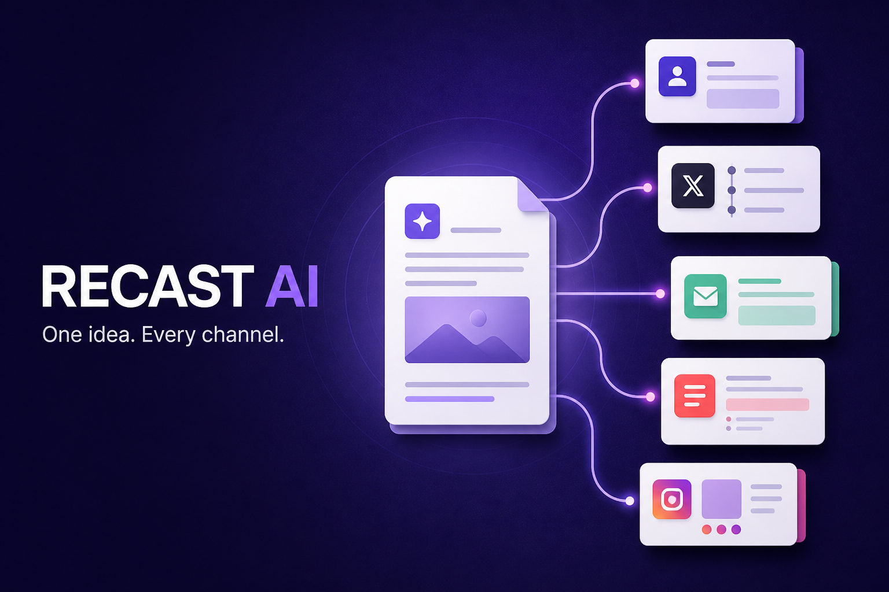

# Recast AI · Content Repurposing Studio

**[Open the live demo →](https://ai-content-repurposer-orcin.vercel.app)**

Turn an article or transcript into five editable drafts and a seven-day publishing plan. The public portfolio is a working, account-free demo: paste your own source, edit the results, save a project, and export your work.



## Try the workflow

1. Paste at least 20 words or import a `.txt` / `.md` file.
2. Generate LinkedIn, X, newsletter, summary, and Instagram drafts.
3. Edit the drafts and calendar ideas; change each day's readiness.
4. Save the project, reload, and reopen it from **My content**.
5. Export a draft as text or the calendar as CSV.

**Demo mode is extractive:** it formats key sentences from your source. It does not call an AI model or invent performance metrics. Review every draft before publishing. Saved work belongs to this browser and is lost if its site data is cleared.

## What works

- Server-side OpenAI generation with structured output
- Automatic private local fallback when AI is unavailable
- LinkedIn, X, newsletter, summary, and Instagram assets
- Editable outputs and calendar ideas
- Copy, text export, and CSV calendar export
- `.txt` and `.md` import with drag-and-drop
- Create, update, search, open, and delete browser-local projects
- Configurable tone, audience, and generation mode
- Honest device-local activity metrics
- Responsive desktop and mobile interface

## Setup

```bash
npm install
copy .env.example .env.local
npm run dev
```

Add an OpenAI API key to `.env.local` to enable model-powered generation:

```env
NEXT_PUBLIC_DEMO_MODE=false
OPENAI_API_KEY=your_key_here
OPENAI_MODEL=gpt-5-mini
AI_ACCESS_CODE=choose_a_private_access_code
```

Rebuild after changing demo mode, then enter the private access code in **Workspace settings**. The OpenAI key stays on the server. The access code prevents anonymous visitors from spending your API budget. Generation falls back to local drafts when the service is unavailable. See [the model documentation](https://developers.openai.com/api/docs/models/gpt-5-mini) for availability and supported features.

## Deploy on Vercel

Import `hasan1470/ai-content-repurposer`, select **Next.js**, and deploy from the repository root. Use `npm run build`; leave the output directory at the framework default. No environment variables, database, or paid service are required for the demo. The existing Sites manifest and Cloudflare build sources are preserved for reference.

## Scripts

| Command | Description |
| --- | --- |
| `npm run dev` | Start the Next.js development server |
| `npm run build` | Create the Vercel-compatible production build |
| `npm run test` | Verify topical drafts, X limits, and safe CSV cells |
| `npm run lint` | Run ESLint |

## Data and privacy

Saved projects, preferences, and activity totals stay in browser storage. Local generation never uploads source material. In AI mode, source material is sent from the server to the configured OpenAI model to create the requested content suite. There is no automatic social publishing, cloud sync, or team account system. For a public multi-user AI service, add individual accounts, persistent quotas and billing before sharing the AI access code broadly.
